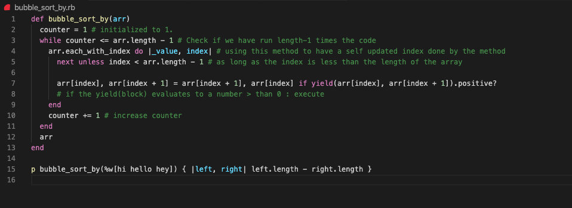

# Project Name

> We build a method #bubble_sort that takes an array and returns a sorted array. It uses the bubble sort methodology
  We also create a similar method called #bubble_sort_by which sorts an array by accepting a block. 

Using yield inside method to accomplish the sorting of a list using the bubble sort methodology . The block will have two arguments that represent the two elements of the array that are currently being compared. If the result of the block execution is negative, the element on the left is “smaller” than the element on the right. 0 means both elements are equal. A positive result means the left element is greater. We use the block’s return value to sort the array. 

## Built With

- Ruby

## Live Demo

## Getting Started

You can use the Repl.it link above to test the functionalities of the sorting method we created. 

To get a local copy up and running follow these simple example steps.

### Prerequisites
    - You need to have ***Ruby*** installed on your machine ([Check this out](https://www.ruby-lang.org/en/documentation/installation/) for instructions on installing ruby)

### Usage
    To run the code go to the local folder where you have the *Ruby file* and run in the terminal `$ ruby file.rb` being 'file' the one you want to run

### Run tests
    - On the first method (`:bubble_sort`) you can change the given array where you call the method (just after the method definition).
    - On the second one (`:bubble_sort_by`) you can change the words inside the array (remember to separate them with spaces).

## Authors

👤 **Carlos Anriquez**

- Github: [@canriquez](https://github.com/canriquez)
- Twitter: [@cranriquez](https://twitter.com/cranriquez)
- Linkedin: [linkedin](https://www.linkedin.com/in/carlosanriquez/)

👤 **Dannison Arias**

- Github: [@dannisonarias](https://github.com/dannisonarias)
- Twitter: [@AriasDannison](https://twitter.com/AriasDannison)
- Linkedin: [Dannison Arias](https://www.linkedin.com/in/dannison-arias-777919190/)

## 🤝 Contributing

Contributions, issues and feature requests are welcome!

Feel free to check the [issues page](issues/).

## Show your support

Give a ⭐️ if you like this project!

## Acknowledgments

- Hat tip to anyone whose code was used
- Inspiration
- etc

## 📝 License

This project is [MIT](lic.url) licensed.
